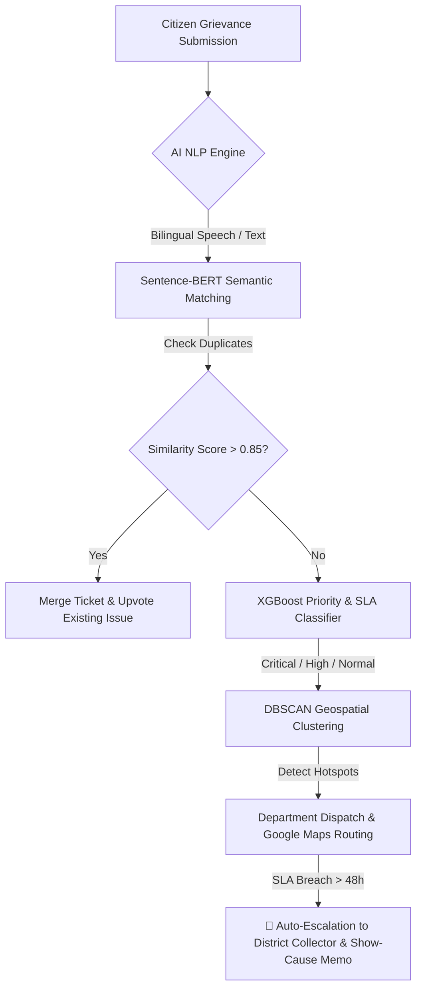

# 🏙️ Erode District Smart Citizen Grievance Redressal Portal
### *ஈரோடு மாவட்ட மக்கள் குறைதீர்க்கும் மற்றும் தானியங்கி நிர்வாக தளம்*

[](http://localhost:8080/)
[](http://localhost:8080/)
[](http://localhost:8080/)
[](http://localhost:8080/)
[](http://localhost:8080/)

---

## 📌 Project Overview

The **Erode District Smart Citizen Grievance Redressal Portal** is a unified, next-generation civic platform connecting citizens, field engineers, and district administrators across the **8 assembly constituencies of Erode district** (*Erode East, Erode West, Bhavani, Gobichettipalayam, Perundurai, Modakkurichi, Anthiyur, Sathyamangalam*).

The portal combines **real-time AI triage**, **browser speech-to-text recording in Tamil & English**, **live camera verification**, **precise GPS mapping**, **automated SLA breach escalation**, and **Google Maps turn-by-turn navigation** for field repair crews.

---

## 🌟 Key Features & Updates

### 1. 👥 Citizen Hub
- **🎙️ Dual Input System (Voice Note & Text):** Citizens can either type their problem or click **"🎙️ Speak in Tamil / English"** to dictate their grievance in real time using native Web Speech Recognition.
- **📷 Verifiable Evidence (Live Camera + GPS):** Real-time camera capture with timestamps and instant Geolocation detection (`lat/lng`) to eliminate false reports.
- **🗺️ Interactive Public Grievance Map:** Live Leaflet GIS map with color-coded severity markers (Critical, High, Medium, Low) and constituency filters.
- **📈 Real-Time Tracking & Timeline:** Live status tracker (`Submitted` ➔ `Under Review` ➔ `In Progress` ➔ `Resolved`).

---

### 2. 🏛️ Department Officer & Field Engineering Hub
- **🛣️ Multi-Department Filtering:** Dedicated views for *Roads & Highways*, *Water Supply*, *Sanitation / Garbage*, *Tamil Nadu Electricity Board (TNEB)*, *Drainage & Sewage*, and *District Collectorate*.
- **🚗 Field Travel & Google Maps Navigation:** Turn-by-turn driving directions from the engineer's location directly to the repair landmark with a single click.
- **📍 Leaflet Inspection Pin Modal:** Modal popup showing exact coordinates and satellite pin for field inspection.
- **⚡ Status Management:** Real-time updates with immediate SLA recalculation.

---

### 3. 🚨 Higher Official Directives & Show-Cause Notices
- **🔔 Topbar Notification Bell & Live Badge:** Alerts department in-charges about delayed or SLA-breached complaints.
- **⚠️ Show-Cause Directives:** Official communications issued by the **Office of the District Collector** or **Master Admin** demanding field crew dispatch within 12–24 hours.
- **⚡ Acknowledge & Compliance Verification:** Officers can acknowledge directives, deploy field crews, and submit compliance reports online to auto-resolve complaints.

---

### 4. 👑 Master Super Admin Control Hub (`sanjai090`)
- **👥 Manage Citizens:** View all registered citizens across Erode's 8 constituencies, check complaint count, suspend/activate accounts, and issue password reset links.
- **🛡️ Manage Department Officials:** Directory of authorized nodal officers and field staff with On-Duty toggles and an **"➕ Add New Department Officer"** registration modal.
- **🏛️ Issue Higher Official Directives:** Ability to target any delayed complaint and dispatch an official show-cause memo to the respective department head.

---

### 5. 🤖 Bilingual AI Civic Guide Chatbot (Erode CivicBot)
- **💬 Floating Assistant Widget:** Accessible via the floating chat launcher on every page.
- **🌐 Full Bilingual NLP Support:** Auto-detects and responds in **Tamil (`தமிழ்`)** or **English (`EN`)**.
- **⚡ Quick Suggestion Chips:** Instant answers for complaint registration, voice notes, GPS capture, officer navigation, SLA policies, and admin logins.
- **🎯 Interactive Action Triggers:** Chatbot provides direct clickable links (e.g. `➕ Open New Complaint Form →`, `🔑 Open Official Login →`, `🗺️ View Map →`).

---

### 6. 🌐 100% Full-Screen Bilingual Translation Engine
- Instant switching between **English** and **Tamil (`தமிழ்`)** across all headers, stats, auth forms, multi-step grievance inputs, admin tables, modals, chatbot, and error messages.

---

### 7. 🚪 Universal Sign Out System
- Dedicated **`🚪 Sign Out / வெளியேறு`** buttons located on all Citizen & Admin topbars, sidebars, and profile tabs.

---

## 🔑 Login Credentials

| Role | Username / ID | Password | Access Scope |
| :--- | :--- | :--- | :--- |
| **👑 Master Super Admin** | `sanjai090` | `Sanjai@0505` | Full District Control, Citizen & Officer User Management, Directives Dispatch |
| **🏛️ Department Officer** | `admin` | `admin@2026` | Department-specific tasks (Roads, Water, Sanitation, TNEB, Drainage, Collectorate) |
| **👥 Public Citizen** | *Any Mobile / Email* (e.g. `9876543210`) | *Any Password* | Citizen Grievance Submission, Voice Note, GPS Map, Personal History |

---

## 🧠 AI / ML & Algorithmic Architecture



1. **XGBoost Priority & SLA Classifier:**
   - Evaluates keyword severity, infrastructure category, and location density to assign strict SLA windows (24h for critical hazards, 48h for high, 7 days for standard).
2. **Sentence-BERT Duplicate Detection:**
   - Compares grievance text embeddings against existing database tickets to prevent duplicate work orders.
3. **DBSCAN Geospatial Density Clustering:**
   - Analyzes coordinates (`lat, lng`) to automatically identify recurring civic hotspots across Erode.
4. **Bilingual Speech & NLP Intent Recognition:**
   - Web Speech API and conversational intent matching for the real-time Civic Guide chatbot.

---

## 💻 Tech Stack

- **Frontend Core:** HTML5 Semantic Structure, Vanilla JavaScript (ES6+), Vanilla CSS3 Design Tokens.
- **Design System:** Navy Enterprise Government Palette (`#0f172a`, `#1e3a5f`, `#2563eb`), Clean White Cards, Responsive Flex/Grid.
- **Mapping & GIS:** Leaflet.js, OpenStreetMap Tiles, Google Maps Direction API.
- **Audio & Media:** Web SpeechRecognition API, MediaDevices Camera Stream API.
- **Local Server:** Python 3 Built-in HTTP Server (`python -m http.server 8080`).

---

## 🚀 How to Run Locally

1. **Clone the repository:**
   ```bash
   git clone <repo-url>
   cd "KARPAGAM COLLEGE"
   ```

2. **Start the local server:**
   ```bash
   python -m http.server 8080
   ```

3. **Open in browser:**
   ```text
   http://localhost:8080/
   ```

---

## 📁 Repository Structure

```text
├── index.html              # Primary Single-Host Unified Application (Auth, Citizen & Admin)
├── app.js                  # Core Logic, I18N Engine, Data Stores, Chatbot, Web APIs
├── style.css               # Modern Design System, Layout Tokens, Chatbot & Table Styles
├── admin.html              # Standalone Department & Admin Portal
├── dashboard.html          # Standalone Citizen Dashboard Portal
└── README.md               # Complete Project Documentation & Hackathon Pitch Guide
```

---

## 🏆 Hackathon Demo Flow (3-Minute Pitch Script)

1. **Problem (30s):** Traditional grievance redressal systems suffer from language barriers, lack of precise GPS navigation for field workers, and zero accountability for overdue tickets.
2. **Citizen Submission Demo (60s):** Open `http://localhost:8080/` ➔ Click `தமிழ்` ➔ Use **🎙️ Voice Note** to speak a road repair grievance in Tamil ➔ Detect **📍 Live GPS & Camera** ➔ Submit and receive tracking ID `CMP-2024-001`.
3. **Officer & Navigation Demo (45s):** Login as `admin` / `admin@2026` ➔ Filter by *Roads & Highways* ➔ Click **`🚗 Navigate`** to launch instant Google Maps driving directions to the pothole.
4. **Super Admin & Directives Demo (45s):** Login as `sanjai090` / `Sanjai@0505` ➔ Review SLA Overdue alerts ➔ Dispatch a **🚨 Show-Cause Memo** to the Department Incharge ➔ Manage Citizen & Officer accounts ➔ Test **🤖 Erode CivicBot** for instant bilingual guidance.

---

*Developed with ❤️ for Erode District Administration & Smart Governance.*
